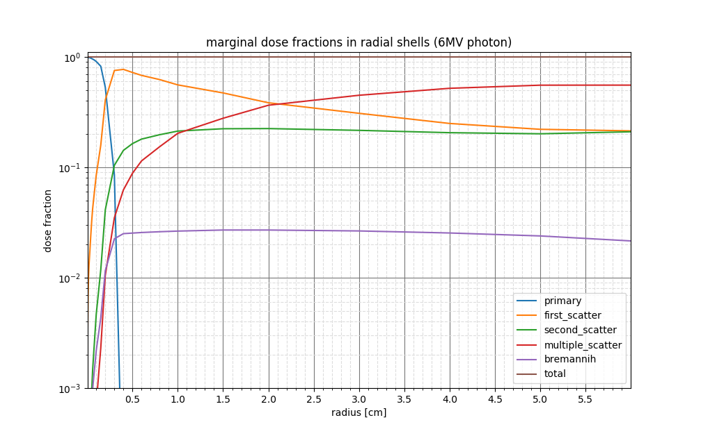

Multi-GPU Photon Dose Calculation
=================================
|                          |                      |
|--------------------------|----------------------|
| **Author**               | Ryan Neph            |
| **Maintainer**           | Ryan Neph            |
| **Maintainer Email**     | ryanneph@ucla.edu    |
| **Version**              | v0.8.0 (pre-release) |
| **Version Release Date** | 13 July 2018         |

 -----------------------

## Package Overview:
Multi-GPU photon dose calculation software capable of computing full-beam dose and beamlet dose in the 4pi space.

### Organization:
This package consists of 3 primary executable targets as follows:
#### dosecalc-preprocess
* [<u>master node</u>]: performs dicom ingestion and resampling, beamlist import and assignment to worker nodes, configuration parsing and setting initialization.

#### dosecalc-beam
* [<u>worker nodes</u>]:  iterates through assigned beamlist, computing volumetric dose distributions for each beam, accumulating results into a single dose array.
* **This is what you should use to compute the final dose distribution volume using optimzed fluence intensities**

#### dosecalc-beamlet
* [<u>worker nodes</u>]: iterates through assigned beamlist, computing local volumetric dose distributions for each beamlet of each beam.
    Beamlet dose coefficients are stored independently of other beamlets' for use in fluence map optimization tasks. 
* **This is what you should use to calculate the dose coefficient matrix used in fluence map optimization.**

Documentation is located in [\<dosecalc-root>/dosecalc_gpu/doc]() and contains some useful resources including:
* _Configuration file schema_
* _Output data file format schema_
* _Beamlist file format examples_
* _Structures file format examples_
* _Changelogs_
* ...

### Configuration
Many options can be configured using either command line arguments (cli args) or config file properties.
For those options that may be specified using either method, cli argument specification will take precedence over config file specification. 
For a complete list of valid cli args execute the program with the `--help` flag. For a complete list of valid config file properties, read [\<dosecalc-root>/dosecalc_gpu/doc/schema_doc/config.md]()

### Mandatory Input
All dose calculation sessions must be executed with the following inputs (specified using cli args or config file properties where appropriate):
* `--dicom=<path-to-dicom-directory>`: absolute/relative path to a single directory containing all CT slices in _.dcm_ format, and a single RTStruct file in _.dcm_ format.
No special naming conventions are required besides the standard _.dcm_ extension.

* One of:
    - `--beamlist=<path-to-beamlist-file>`: specification of beams for which dose will be calculated.
        The beamlist format is described in [\<dosecalc-root>/dosecalc_gpu/doc/schema_examples/example_beamlist.txt]().
        Fluence maps for beams specified in this way are initialized to binary projections of the target anatomy onto the fluence plane at the isocenter.
    - `--fmaps=<path-to-fmaps-file>`: specification of beams and associated fluence map intensities for which dose will be calculated.
        Fluence maps may be defined by the user or a fluence map optimization algorithm.
        This input type is common for obtaining high fidelity full beam dose distributions for optimized beams. 

### Common Options
* `--voxsize=<float>`: set voxelsize of dose volume output 
* `config:"convlat": <float>`: lateral ray spacing used during dose calculation [cm]
* `config:"convstep": <float>`: longitudinal step size used during dose calculation [cm]
* `config:"kernel-extent": <float>`: dose kernel radial range cutoff (dose approximation for speed tradeoff)

---------------------------

## Getting Started
### Running (single node)
0. change the working directory to [\<dosecalc-root>/dosecalc_gpu/]()
1. execute `dosecalc-preprocess`, supplying problem setup and quality options as necesary
2. execute `dosecalc-beamlet` or `dosecalc-beam`

### Running (multi node)
coming soon

---------------------------

## Troubleshooting
There are some limitations on the selection of quality parameters available that aren't strictly enforced during runtime (yet). As a result, the code may produce an error if too much GPU memory is requested based on the chosen settings.
If you encounter the following errors please try the associated suggestions:

From v0.8 and newer, automatic batched processing of beamlets should automatically be enabled to handle these situations. No interaction from the user should be necessary.
If automatic batching fails, first try manually enabling batched processing by using the argument: __`dosecalc-beamlet --nbatches=<int>`__ to select the lowest number of batches required to successfully run the process. If this technique fails as well, please follow these suggestions or contact a developer:

___"terminate called after throwing an instance of 'ArraySizeError'"___
* first try increasing `config:"max-rev-size": [<float>, <float>, <float>]` if possible (if no new errors are produced)
* then increase the `--voxsize=<float>`, `config:"convlat": <float>`, and `config:"convstep": <float>` settings
* and/or decrease `config:"kernel-extent": <float>`

___CUDA error at [...] code=2(cudaErrorMemoryAllocation) "cudaMalloc( (void**)&stream\_data[\_threadid].bevDens, revSize )"___
* decrease `config:"max-rev-size": [<float>, <float>, <float>]` if possible (if no new errors are produced)
* increase `--voxsize=<float>` , `config:"convlat": <float>`, and `config:"convstep": <float>` settings until no errors are produced

---------------------------

Appendices
----------
### Appendix A - Selecting Kernel Extent (dosecalc-beamlet only)
During beamlet dose calculation, one can decrease the dose kernel radial extent to increase the computational speed at the cost of reduced dose accuracy.
For help in selecting the optimal radial extent, consult the plot of cumulative dose fraction for each radial shell for the beam energy desired. ([\<dosecalc-root>/dosecalc_gpu/doc/resources/kernel_plots/]())
<!--  -->
<!--  -->

### Appendix B - External Resources
Various scripts have been written supporting data I/O in the python and matlab scripting languages. Please see:
* MATLAB:
    * [\<dosecalc-root>/dosecalc_gpu/extern/matlab/read_dose_data.m]()
    * [\<dosecalc-root>/dosecalc_gpu/extern/matlab/open_masks.m]()
* Python:
    * [\<dosecalc-root>/dosecalc_gpu/extern/python/read_dose_data.py]()
    * [\<dosecalc-root>/dosecalc_gpu/extern/python/fmo_io.py]()
