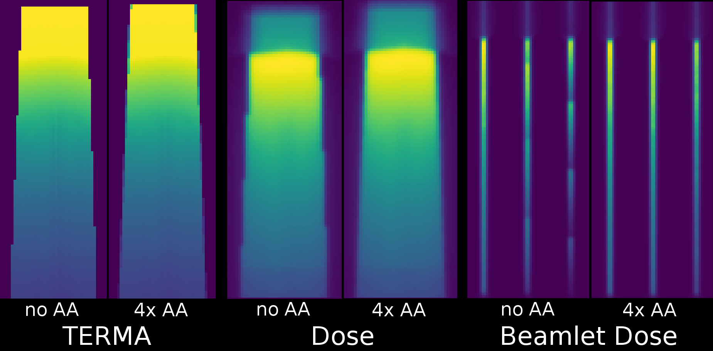
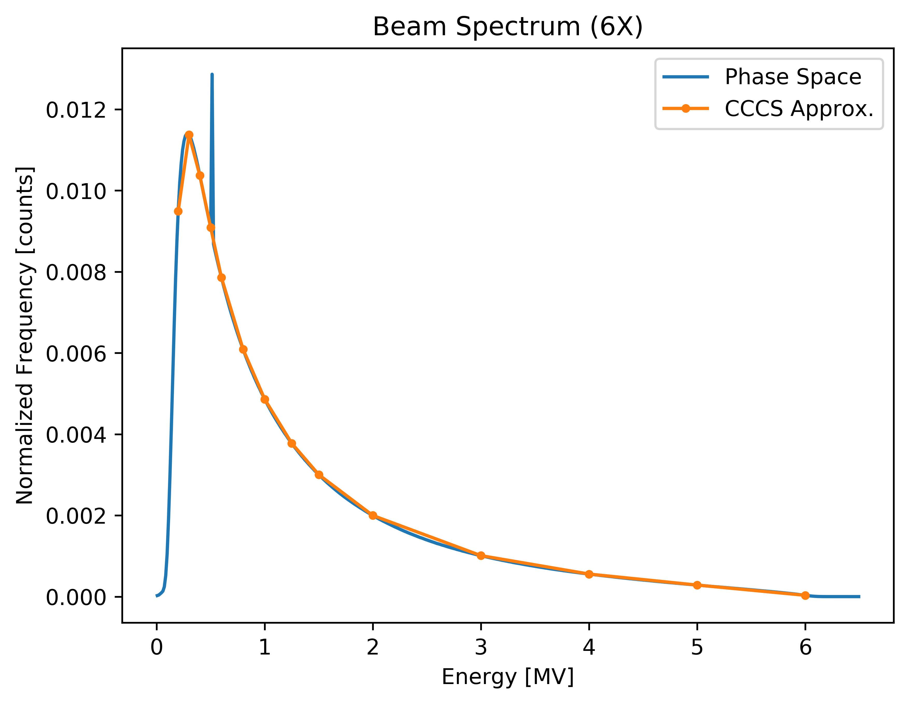

Release Notes - Dose Calculation
===================================
|             |                     |
|-------------|---------------------|
| **Author**  | Ryan Neph           |
| **Version** | 0.8.0 (pre-release) |
| **Date**    | 2018 July 13        |

----------------------

Features:
---------
* Anti-aliasing (MSAA) added during TERMA calculation for `dosecalc-beam` and `dosecalc-beamlet`. No more jaggies on the edge of the TERMA beam. Supersampling rate can be customized via use of the cli argument `dosecalc-preprocess --ssfactor=<int>` or set in the config file using the same keyword. Set to `1` to disable and restore behavior from previous versions.

* CT Hounsfield Units to electron density conversion now uses lookup table. A hardcoded table is provided based on the Siemens CT scanners. Users may also provide their own LUT by specifying the text file with `dosecalc-preprocess --ctlut=<filename>` or set it in the config file using the same keyword. An example of the valid specification format is located at `<dosecalc>/doc/examples/example_lut.txt`.
* Added dynamic beamlet batching in `dosecalc-beamlet` to overcome out-of-memory issues when `--convstep=<float>` and `--convlat=<float>` are set very low, the number of active beamlets is very high, or the `--kernel-extent=<float>` is set very high. Rather than trying to calculate dose for all of a beam's beamlets in a single pass, they are separated into evenly sized batches and recombined in the sparse output file. This comes at the cost of longer calculation times, but the high quality dose calculation that this enables was otherwise impossible to calculate without the out-of-memory errors before. <strike>No interaction from the user is necessary, batching will be enabled automatically when necessary and messages will be presented to the user in `--verbose` mode when this occurs.</strike> Presently, user must manually enable using the command line option `dosecalc-beamlet --nbatches=<int>` when calling the beamlet dose calculation program. This will manually set the # batches for all beams so calculation times may be longer than in the official release when auto-detection is enabled.
* Finer control over convolution voxelsize as separate lateral (parallel ray spacing) and longitudinal (line convolution step size) settings. These may both be set via the cli using `dosecalc-preprocess --convlat=<float> --convstep=<float>` or set in the config file using the same keywords.
* Added support for simple density geometry specification as an HDF5 file and fmaps file (describing beams and fluence maps) via the cli argument `--density=<filename> --fmaps=<filename>`. This is useful for calculating in arbitrary or user generated geometry where generating a DICOM and RTSTRUCT would be cumbersome. The user is responsible for defining the fluence maps when using this option as there will not be any structure information from which to generate fluence map projections.
* Added new beam spectrum definition `spec6X_mcpsf.spec` which has been fit to the golden beam (phase space file) spectrum of the Varian TrueBeam 6MV output witihin the mono-energetic kernels available:

* Added "Aperture Ready" post-processing to automatically defined binary fluence maps. To use, apply the `--aperture-ready` flag as an argument when calling `dosecalc-preprocess`. This post-processor operates over the rows of the fluence map, filling holes in the active segments until only 1 contiguous active segment remains, allowing optimization of DAO plans. If operation over columns is desired, set the collimator rotation to 90 or -90 degrees.

Interaction Changes:
--------------------
* Dosecalc has been re-located to independent repository. It is no longer a submodule of the rs4pi project.
* Significant changes to the Config file interface and command line arguments. Please review documentation to assist in converting user scripts (see: `<dosecalc>/doc/schema_doc/config.md` and `<dosecalc>/doc/schema_examples/example_config.json`)
* The cli argument `--revvoxsize` has been deprecated in favor of the separate settings `--convlat` and `--convstep` that allow finer grained control over the convolution procedure. To restore the behavior of previous versions, replace `--revvoxsize=<float>` with `--convlat=<float> --convstep=<float>`. When not specified, default behavior is for that setting to match the current setting of `--voxsize`.

----------------------

Bug-fixes:
----------
* Fixed `read_dose_data.m` script missing the `contains` function.
* out-of-memory errors caused by trying to run high quality dose calculation are resolved with implementation of dynamic beamlet batching.
* Fixed out-of-bounds error in GPU raytracing function during TERMA calcualation that didn't affect accuracy of output but could cause a crash in some cases.
* Fixed recognition of `--sparsify-threshold` argument in `dosecalc-beamlet` which was incorrectly recognized as `--sparsify_threshold` before, contrary to documentation.

---------------------

Questions & Concerns:
---------------------
Please contact the package maintainer: Ryan Neph [\<ryanneph@ucla.edu>](mailto:ryanneph@ucla.edu>) with any error reports or questions.
