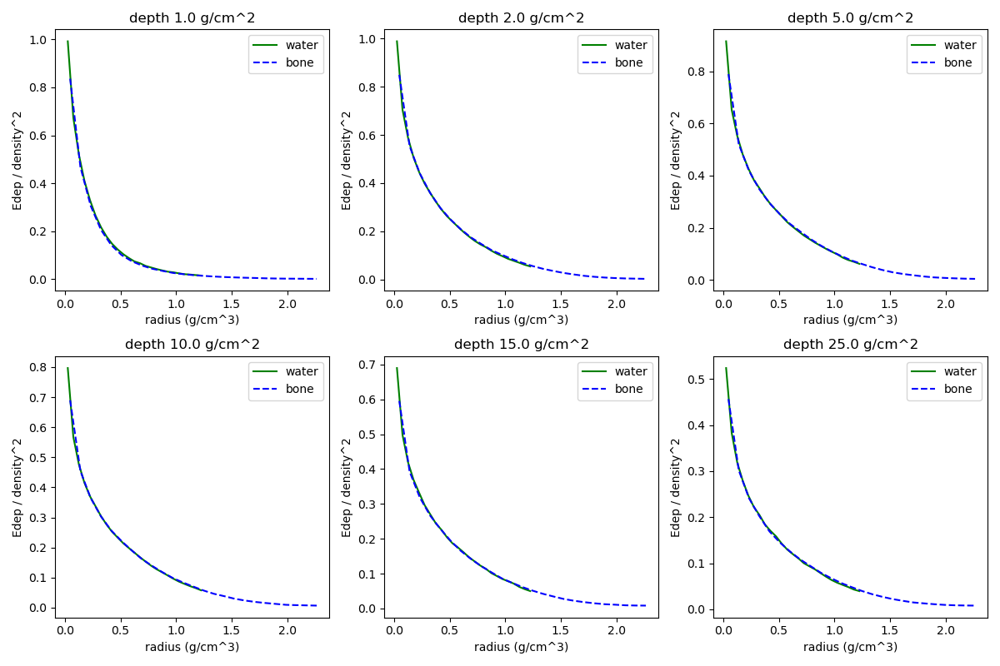
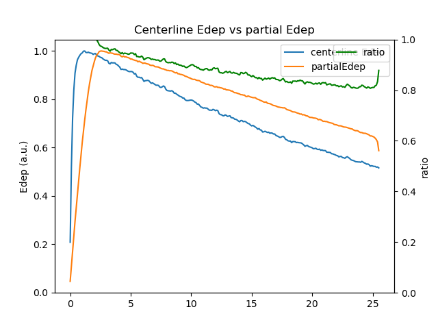
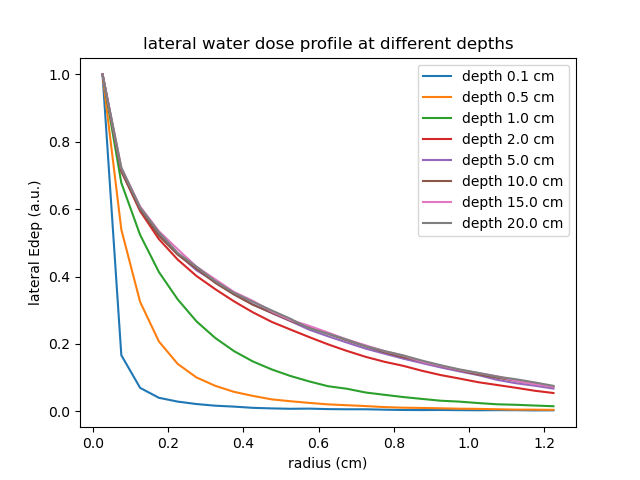

# Theory
Here we are to derive the dose kernel hypothesis. The physics process of dose deposition can be viewed as a 2-step process: 1) Energy transfer and 2) Energy deposition. The first step is that primary photons interact with material, and transfer its energy to material or secondary particles. The second step is that the secondary or multi-scattered particles deposit their energy locally.

Here we consider a homogeneous phantom. The energy transfer, or total energy released per unit mass (Terma), in the first step can be easily calculated using the equation below:

$$T(\vec{x})=F(\frac{1}{||\vec{x}-\vec{s}||}(\vec{x}-\vec{s}))
\exp{\left(-\int_0^1\rho\left((1-t)\vec{s}+t\vec{x}\right)||\vec{x}-\vec{s}||dt\right)
\frac{1}{||\vec{x}-\vec{s}||^2}},$$

The first term is the original fluence map value at direction $\frac{1}{||\vec{x}-\vec{s}||}(\vec{x}-\vec{s})$, the second term corresponds to linear attenuation, and the third term reflects inverse square law.
A dose kernel is used to calculate the dose distribution, by convolving itself with Terma. According to [Lu $et$ $al.$](https://iopscience.iop.org/article/10.1088/0031-9155/50/4/007)

$$D(\vec{x})=\frac{1}{\rho(\vec{x})\Delta V_x} \iiint T(\vec{s})\rho(\vec{s})[\eta(\vec{x})\bar{\eta}^2h(\vec{r}(\vec{s};\vec{x})))\Delta V_x]dV_s,$$

Where $\vec{s}$ is the source (TERMA) point, $\vec{x}$ is the destination (dose) point, $T(\vec{s})$ is the Terma from the primary energy fluence in the volume element $dV_s$, $\rho$ is the density, $\Delta V_x$ is the destination volume, $h(\vec{r})$ is the normalized energy deposition kernel $\left(\iiint_\infty h(\vec{r})dV_r=1\right)$, $\vec{r}(\vec{s};\vec{x})=\int_s^x\eta(\vec{t})d\vec{t}$, $\eta$ is the relative (to water) density ($\eta=\rho/\rho_w$) and $\bar{\eta}$ is the mean relative density between $\vec{s}$ and $\vec{s}$. In the case of homogeneous phantom, we have $\rho(\vec{x})\equiv\rho_w$, so the dose equation degenerates to:

$$D(\vec{x})=\iiint T(\vec{s})h(\vec{x}-\vec{s})dV_s$$

From here on, we interpret $h(\vec{x})$ as a function of geometric displacement instead of radiological displacement. In collapsed-cone convolution superposition (CCCS) algorithm, the secondary particles are viewed to be rectilinearly transmitted. Under this assumption, the dose kernel is subject to linear attenuation and inverse square law:
$$h(\vec{x})=H(\eta\vec{x})\frac{1}{||\vec{x}||^2}.$$

Then we consider the dose distribution of an infinitesimal pencil beam (IPB) in a homogeneous phantom. In this case, the inverse square factor is omitted, and we let the fluence map value to be 1. The Terma distribution is:

$$T(\vec{x})=T(x_1,x_2,x_3)=\eta\exp{(-\eta x_3)}\delta(x_1)\delta(y_2).$$
Here we assume $x_3$ is along the depth of the homogeneous phantom. The leading $\eta$ ensures the normalization. Then we obtain the dose distribution:

$$
\begin{aligned}
D(\vec{x}) &= D(x,y,z) \\
&= \iiint T(s_1, s_2, s_3)h(x_1-s_1, x_2-s_2, x_3-s_3)ds_1ds_2ds_3 \\
&= \iiint \eta\exp{(-\eta s_3)}\delta(s_1)\delta(s_2)H\left(\eta (x_1-s_1), \eta (x_2 - s_2), \eta (x_3 - s_3)\right) \\
& \frac{1}{(x_1-s_1)^2+(x_2-s_2)^2+(x_3-s_3)^2} ds_1 ds_2 ds_3 \\
&= \int \eta\exp(-\eta s_3)H(\eta x_1, \eta x_2, \eta (x_3-s_3)) \frac{1}{x_1^2+x_2^2+(x_3-s_3)^2}ds_3 \\
&= \eta^2 \int \exp(-\eta s_3)H(\eta x_1, \eta x_2, \eta (x_3-s_3))\frac{1}{\eta^2x_1^2+\eta^2x_2^2+\eta^2(x_3-s_3)^2}d\eta s_3.
\end{aligned}
$$

It means that, at the same radiological coordinate $\eta\vec{x}$, the dose in different homogeneous phantom is proportional to $\eta^2$.

# Experiment
Below we are to test this conclusion using Monte Carlo simulation data. In the simulation, a cylindrical phantom is used, which is partitioned into elements for dose scoring. We use a cylindrical coordinate frame to index the elements. In other words, we firstly partition the cylindrical phantom into disks of thickness $dz$, and subsequently partition each disk into concentric rings of thickness $dr$. As the above equation indicates, the dose can be expressed in the following equation:

$$D(x_1,x_2,x_3)=\eta^2K(\eta x_1, \eta x_2, \eta x_3),$$

or in cylindrical coordinates:

$$D(r,z)=\eta^2K(\eta r, \eta z).$$

Now we calculate the energy deposited in the ring spanning $[z_0-\frac{dz}{2}, z_0+\frac{dz}{2}] \times [r_0-\frac{dr}{2}, r_0+\frac{dr}{2}]$:

$$
\begin{align}
E&=\int_{z_0-\frac{dz}{2}}^{z_0+\frac{dz}{2}}dz\int_{r_0-\frac{dr}{2}}^{r_0+\frac{dr}{2}}2\pi rdrD(r,z)\eta \\
&=\int_{z_0-\frac{dz}{2}}^{z_0+\frac{dz}{2}}dz\int_{r_0-\frac{dr}{2}}^{r_0+\frac{dr}{2}}2\pi rdr \eta^2K(\eta r, \eta z)\eta \\
&\simeq \eta^2 \cdot 2\pi \eta rK(\eta r, \eta z)dr dz.
\end{align}
$$

It means that at the same radiological coordinate $(\eta r, \eta z)$ and geometric thickness $dr$, $dz$, the energy deposition is proportional to $\eta^2$. This conclusion is supported by Monte Carlo data, as shown in the figure below:

# Lateral profile v.s. depth
It is shown in the figure above that the lateral dose profile depends on the depth. Here we study the dependency. Firstly, we look at the comparison between the centerline dose and the partial dose, as shown in the figure below. In this figure, both the centerline and the partial doses are normalized by their individual maximum value. This figure is related to the topic "lateral profile v.s. depth", because if the lateral dose profile is constant for all depths, the ratio between the centerline dose and the partial dose should be constant.

We can observe a significant deviation between the centerline and partial energy depositions. As indicated by the green curve, the ratio did not reach a constant at depth 25 cm.

We then take a look at the lateral dose profiles at different depths, as shown in the figure below. It manifests that the dose lateral dose profile reaches an equilibrium state beyond 5 cm depth.

